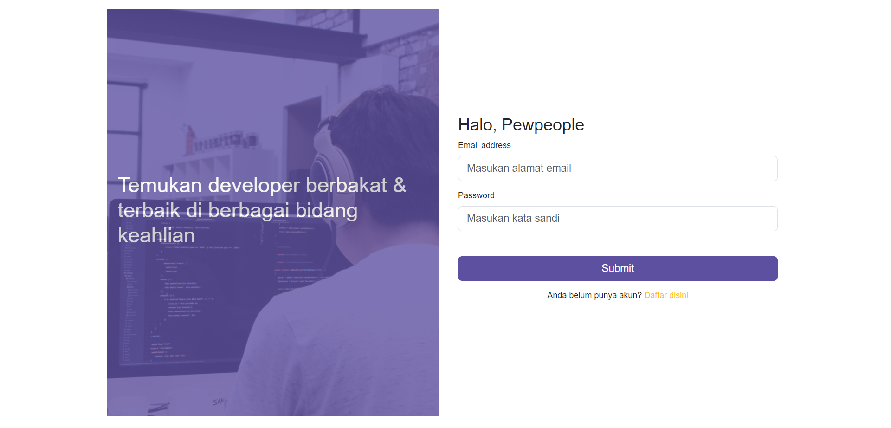
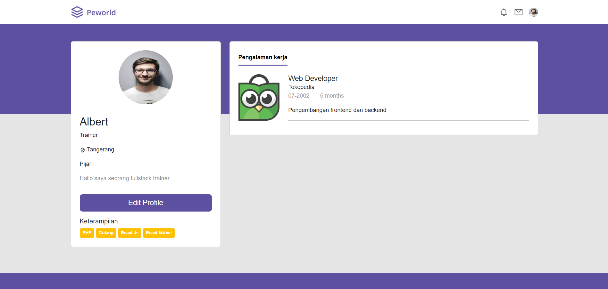

<br>

# Hire Job
Website Hire Job adalah Website untuk membantu perusahaan mencari kandidat yang sesuai dengan kriteria yang di butuhkan. Aplikasi ini menggunakan database postgresQL, Express JS untuk pembuatan backend dan menggunakan library Next js, bootstrap 5, axios, dan Redux untuk pembuatannya frontend.

## Instal
Situs Resep Makanan dapat berjalan di lokal Anda, unduh repo ini dan buka menggunakan kode studio visual, dan jalankan terminal seperti di bawah ini.
```sh
cd food-recipe-fe-react
npm i
npm run dev
```

## Fitures Aplikasi Pijar Food FE
- Pencarian kandidat pekerja
- Edit Profile pekerja
- Daftar list pekerja
- Halaman rekrut pekerja

## Tech
- [Bootstrap](https://getbootstrap.com/) - Framework CSS yang di dalamnya berisi template HTML, CSS, dan JavaScript yang untuk membuat sebuah website yang responsif dengan cepat dan mudah
- [HTML] - Hypertext Markup Language, yaitu bahasa markup standar untuk membuat dan menyusun halaman dan aplikasi web
- [CSS] - Cascading Style Sheet yaitu digunakan untuk mengatur tampilan elemen yang tertulis dalam bahasa markup
- [Google Chrome](https://www.google.com/chrome) - Google Chrome merupakan perangkat lunak yang memiliki fungsi untuk mencari, mengakses, dan menampilkan segala bentuk informasi
- [JavaScript] - pemrograman yang digunakan dalam pengembangan website agar lebih dinamis dan interaktif
- [Sweetalert2](https://sweetalert2.github.io/) - library JavaScript yang menyediakan berbagai pilihan bagi kita untuk membuat berbagai jenis pop-up alert seperti alert biasa, alert error, alert success, alert konfirmasi, dan sebagainya.
- [Next JS](https://nextjs.org/) - framework untuk React.js yang cocok untuk membuat website dengan berbagai fitur unggulan seperti Routing Pages dan Fast Refresh.
- [Redux] (https://redux.js.org/) - salah satu library yang biasa digunakan untuk keperluan backend.
- [Redux Toolkit](https://redux-toolkit.js.org/) - official tool yang disediakan oleh team Redux untuk mempermudah kita jika ingin menggunakan Redux pada suatu aplikasi.
- [Axios](https://axios-http.com/docs/intro) - situs web berita Amerika Serikat yang berbasis di Arlington County, Virginia.

## Screenshots
<table>
 <tr>
    <td></td>
  </tr>
  <tr>
    <td>Login</td>
  </tr>
 <tr>
  <td></td>
 </tr>
  <tr>
    <td>Register</td>
  </tr>
 <tr>
  <td> </td>
 </tr>
  <tr>
   <td>Home</td>
  </tr>
  <tr>
    <td> </td>
  </tr>
   <tr>
    <td>Edit</td>
  </tr>
 <tr>
   <td> </td>
 </tr>
 <tr>
     <td>Profile</td>
  </tr>
   <tr>
   <td> </td>
 </tr>
 <tr>
     <td>Hire</td>
  </tr>
</table>

## Related Project

- [`Frontend Recipe Food`](https://github.com/MuhammadSonySetiawan/hirejob)

- [`Backend Recipe Food`](https://github.com/MuhammadSonySetiawan/hire_job_be)

- [`Demo Recipe Food`](https://hirejob-ep6k.vercel.app/)
