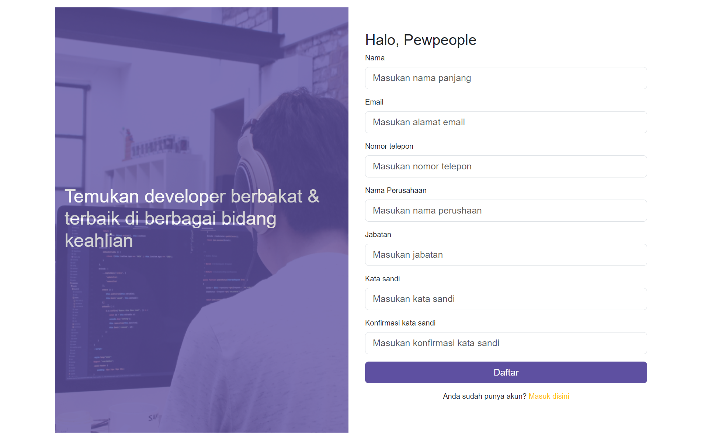
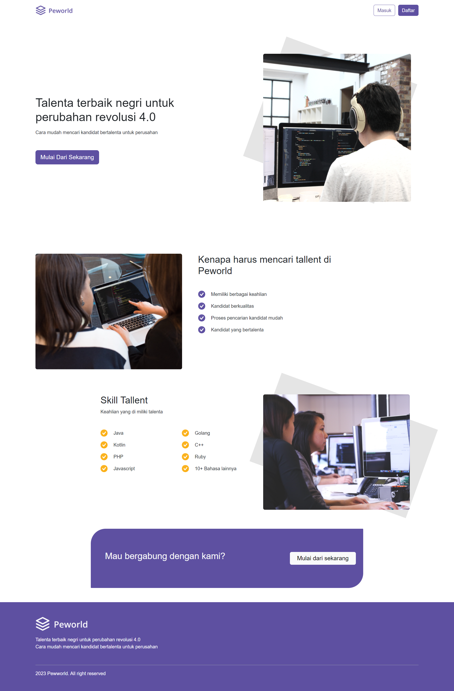

<br>

# Hire Job
Hire Job Website is a platform designed to assist companies in finding candidates that match their specific criteria. This application utilizes a postgresQL database, Express JS for backend development, and incorporates Next.js, Bootstrap 5, axios, and Redux libraries for frontend development.
## Instal
The Hire Job website can run on your local machine. To do this, download this repository and open it using Visual Studio Code. Then, run the terminal with the following commands below.
```sh
cd food-recipe-fe-react
npm i
npm run dev
```

## Fitures Aplikasi Pijar Food FE
- Candidate job search
- Worker profile editing
- Worker list registration
- Worker recruitment page

## Tech
- [Bootstrap](https://getbootstrap.com/) - The CSS framework that contains HTML, CSS, and JavaScript templates for creating a fast and easy-to-build responsive website.
- [HTML] - Hypertext Markup Language, commonly known as HTML, is the standard markup language used to create and structure web pages and web applications.
- [CSS] - Cascading Style Sheet, commonly known as CSS, is used to control the presentation and layout of elements written in a markup language.
- [Google Chrome](https://www.google.com/chrome) - Google Chrome is a software that serves the function of searching, accessing, and displaying all kinds of information.
- [JavaScript] - The programming used in website development to make it more dynamic and interactive.
- [Sweetalert2](https://sweetalert2.github.io/) - JavaScript library that provides various options for creating different types of pop-up alerts, such as regular alerts, error alerts, success alerts, confirmation alerts, and more.
- [Next JS](https://nextjs.org/) - A framework for React.js that is suitable for building websites with various outstanding features such as Routing Pages and Fast Refresh.
- [Redux](https://redux.js.org/) - One of the libraries commonly used for backend purposes.
- [Redux Toolkit](https://redux-toolkit.js.org/) - The official tool provided by the Redux team to facilitate the use of Redux in an application.
- [Axios](https://axios-http.com/docs/intro) - A United States news website based in Arlington County, Virginia.

## Screenshots
<table>
 <tr>
    <td></td>
  </tr>
  <tr>
    <td>Login</td>
  </tr>
 <tr>
  <td></td>
 </tr>
  <tr>
    <td>Register</td>
  </tr>
 <tr>
  <td> </td>
 </tr>
  <tr>
   <td>Home</td>
  </tr>
  <tr>
    <td> </td>
  </tr>
   <tr>
    <td>Edit</td>
  </tr>
 <tr>
   <td> </td>
 </tr>
 <tr>
     <td>Profile</td>
  </tr>
    <tr>
   <td> </td>
 </tr>
 <tr>
     <td>Top Jobs</td>
  </tr>
   <tr>
   <td> </td>
 </tr>
 <tr>
     <td>Hire</td>
  </tr>
</table>

## Related Project

- [`Frontend Recipe Food`](https://github.com/MuhammadSonySetiawan/hirejob)

- [`Backend Recipe Food`](https://github.com/MuhammadSonySetiawan/hire_job_be)

- [`Demo Recipe Food`](https://hirejob-ep6k.vercel.app/)
